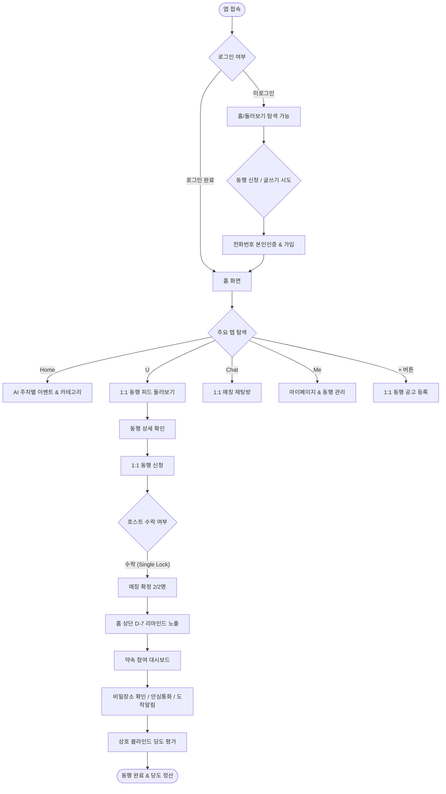
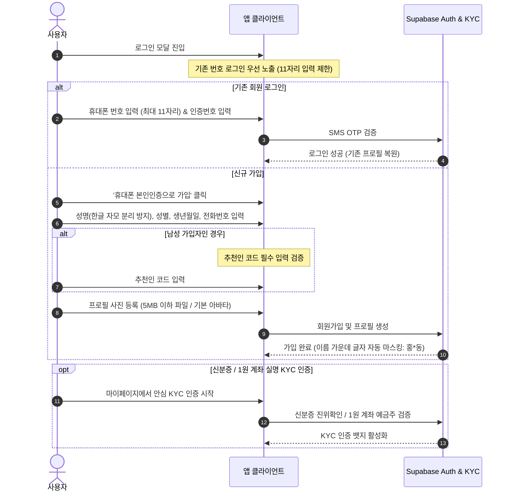
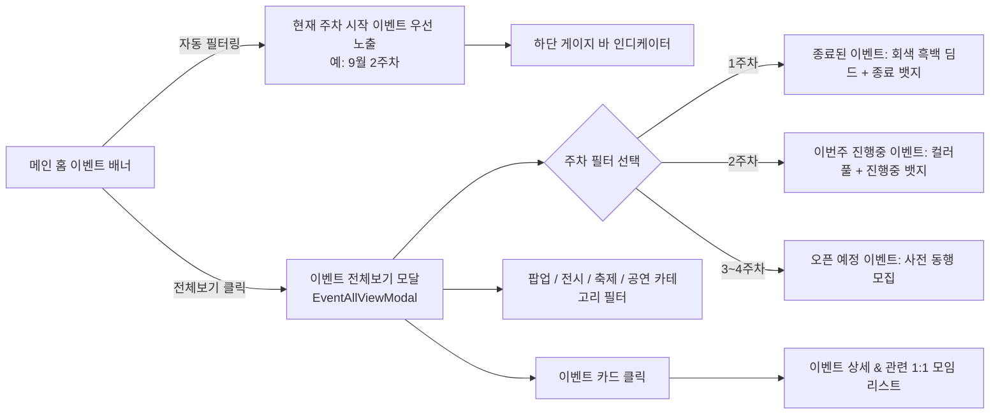
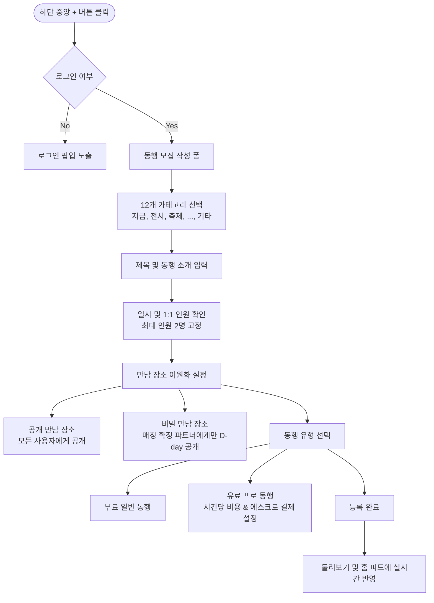
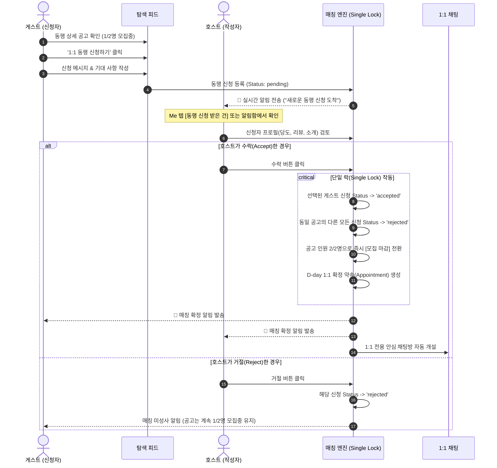
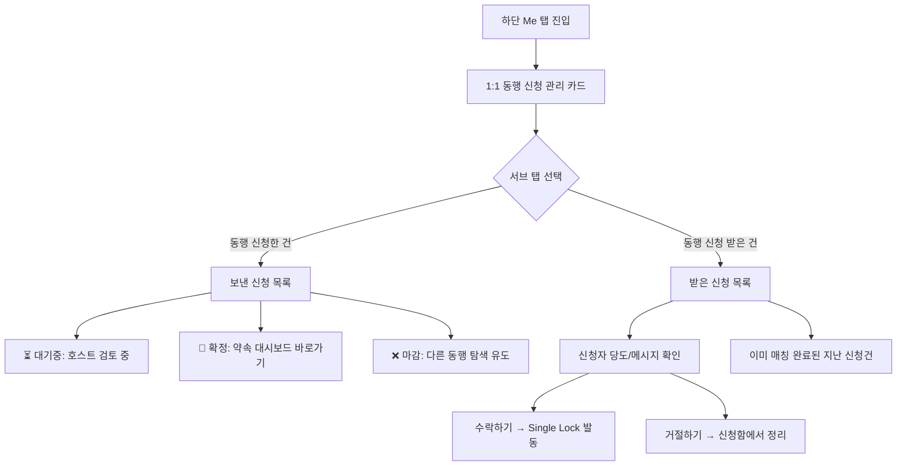
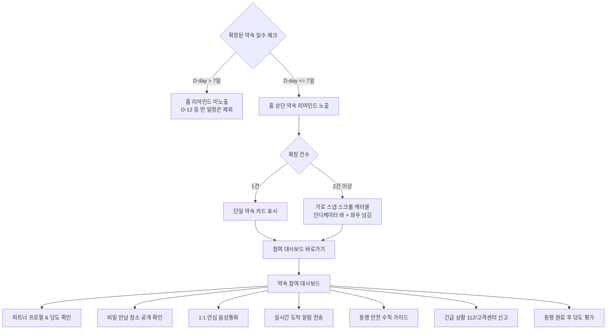

# 🧭 유미당(Yumidang) 종합 유저 플로우 (User Flow)

> **서비스 정의**: 취향 맞는 이웃과 안전하고 부담 없이 만나는 **1:1 실시간 동행 매칭 및 라이프스타일 플랫폼**  
> **핵심 원칙**: 엄격한 1:1 단일 락(Single Lock) 매칭, D-day 리마인드, 안심 대시보드, 상호 블라인드 당도 평가

---

## 1. 🗺️ 전체 하이레벨 유저 저니 (End-to-End User Journey)



---

## 2. 📱 상세 기능별 세부 유저 플로우

### Flow 1. 회원가입 & 본인인증 (Auth & KYC Flow)
사용자의 진입 장벽을 최소화하되, 신원 검증과 성별 맞춤 정책을 철저히 적용합니다.



---

### Flow 2. 홈 탐색 및 AI 문화 이벤트 큐레이션 (Explore & Event Flow)
홈 화면에서 주차별 주요 문화 행사(팝업, 전시, 축제, 공연)를 직관적으로 탐색합니다.



---

### Flow 3. 카테고리 피드 탐색 & '지금이당!' 실시간 급만남 (Category Flow)
12개 그리드 카테고리 중 최상단 1순위에 '지금'을 배치하여 즉시 번개 만남을 지원합니다.

```mermaid
flowchart TD
    Grid[12개 카테고리 그리드]
    
    Grid --> CatNow[1행 1열: '지금' (당! 아이콘)]
    Grid --> CatExhibition[2. 전시]
    Grid --> CatFestival[3. 축제]
    Grid --> CatDining[4. 식사]
    Grid --> CatEtc[12. '기타' (MoreHorizontal 아이콘)]
    
    CatNow -->|클릭| NowFeedModal[지금이당! 전용 피드 모달]
    NowFeedModal --> NowHeader[헤더/배너: '지금 바로 만나는 지금이당! ⚡']
    NowHeader --> NowPosts[오늘/지금 만나는 1:1 급만남 공고]
    
    CatEtc -->|클릭| EtcFeedModal[기타 동행 피드 모달]
    EtcFeedModal --> EtcPosts[보드게임, 취미 등 이색 1:1 동행 공고]
    
    CatExhibition --> ExhibitionPosts[전시 동행 공고]
```

---

### Flow 4. 1:1 동행 공고 등록 (Host Flow)
호스트가 1:1 원칙을 준수하는 공고를 개설합니다.



---

### Flow 5. 1:1 신청 & 단일 락(Single Lock) 매칭 확정 (Join & Match Flow)
유미당만의 핵심 차별점인 **단일 락(Single Lock)** 메커니즘을 통해 다자간 혼선을 원천 방지합니다.



---

### Flow 6. 마이페이지(Me) 통합 동행 신청 관리 (MyPage Request Management)
헤더의 복잡한 버튼을 제거하고, 마이페이지 상단 2개 탭으로 신청 내역을 일원화 관리합니다.



---

### Flow 7. D-day 7일 이하 홈 리마인드 & 참여 대시보드 (D-day & Dashboard Flow)
약속 7일 전부터 홈 화면 최상단에 카운트다운 리마인드를 가로 캐러셀로 제공합니다.



---

### Flow 8. 동행 완료 후 상호 블라인드 평가 (Review & Settlement Flow)
만남 종료 후 상대방에 대한 평가가 상호 완료될 때까지 비공개 처리하여 솔직한 피드백을 보장합니다.

```mermaid
sequenceDiagram
    autonumber
    actor Host as 호스트
    actor Guest as 게스트
    participant ReviewSys as 상호 블라인드 리뷰 시스템
    participant Sugar as 당도 지수 엔진

    Note over Host, Guest: 동행 완료 (약속 시간 경과 후)
    Host->>ReviewSys: 게스트 평가 작성 (매너 태그, 꿀단지 점수, 코멘트)
    Note over ReviewSys: 호스트 평가 제출 완료 (게스트에게는 비공개)
    
    Guest->>ReviewSys: 호스트 평가 작성 (매너 태그, 꿀단지 점수, 코멘트)
    Note over ReviewSys: 양측 평가 제출 완료 확인!
    
    critical 블라인드 해제 & 당도 반영
        ReviewSys->>ReviewSys: 양측 리뷰 동시 공개 (마이페이지 후기 탭)
        ReviewSys->>Sugar: 긍정 피드백 반영 &rarr; 당도 점수 상승 (예: +3도)
        opt 프로 동행인 경우
            ReviewSys->>ReviewSys: 에스크로 예치금 호스트 계좌로 자동 정산(Released)
        end
    end
    ReviewSys-->>Host: 당도 업데이트 알림
    ReviewSys-->>Guest: 당도 업데이트 알림
```

---

## 3. 📊 핵심 엔티티 상태 전이도 (State Transitions)

### 1) 동행 공고 (MeetupPost) 상태
| 상태 값 | 화면 표시 | 조건 및 전이 |
|---|---|---|
| `recruiting` | **1/2명 (모집중)** | 공고 등록 직후 기본 상태. 게스트 신청 가능 |
| `closed` | **2/2명 (모집마감)** | 호스트가 1명의 신청을 수락하여 매칭 확정된 상태 |

### 2) 동행 신청 (JoinRequest) 상태
| 상태 값 | 화면 표시 | 조건 및 전이 |
|---|---|---|
| `pending` | **대기중** | 게스트가 신청서를 전송하여 호스트 검토 대기 중 |
| `accepted` | **수락됨 (확정)** | 호스트가 수락하여 1:1 매칭이 성사된 상태 |
| `rejected` | **거절됨 (마감)** | 호스트가 거절했거나, 다른 게스트가 수락되어 자동 마감된 상태 |

### 3) 약속 리마인드 (Appointment) 노출 정책
| 조건 | 홈 화면 노출 여부 | UI 형태 |
|---|---|---|
| `D-day <= 7일` (1건) | **노출** | 단일 약속 카드 |
| `D-day <= 7일` (2건 이상) | **노출** | 가로 스냅 스크롤 롤링 캐러셀 + 바 인디케이터 |
| `D-day > 7일` (D-8 ~) | **미노출** | 홈 화면 미노출 (마이페이지/채팅에서만 조회) |

---

## 4. 🛡️ 예외 처리 & 안전 정책 (Edge Cases & Safety Rules)

1. **본인 공고 신청 차단**:
   - 자신이 작성한 동행 공고에는 '신청하기' 버튼 대신 '내가 작성한 공고입니다' 안내 표시.
2. **동행 인원 1:1 엄격 제한**:
   - 모든 모집 공고는 최대 정원 2명(호스트 1명 + 게스트 1명)으로 강제 고정.
3. **비밀 장소 보안 유지**:
   - 상세 만남 장소(예: 식당 예약석 번호, 돗자리 정확한 위치)는 매칭이 확정된 파트너에게만 D-day 대시보드에서 해금.
4. **이미지 로드 실패 Fallback**:
   - 프로필 사진 또는 이벤트 배너가 네트워크 사정 등으로 실패할 경우, 앱 전용 고화질 디폴트 아바타/플레이스홀더로 자동 대체되어 UI 깨짐 방지.
5. **동행 전 긴급 취소 및 에스크로 보호**:
   - 프로 동행 결제 시 에스크로는 만남이 안전하게 완료된 후 정산되며, 사전 취소 시 전액 환불 정책 적용.
